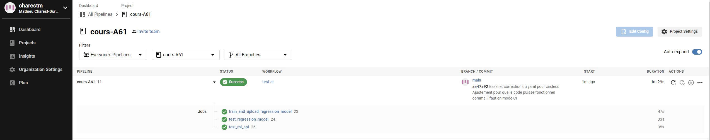
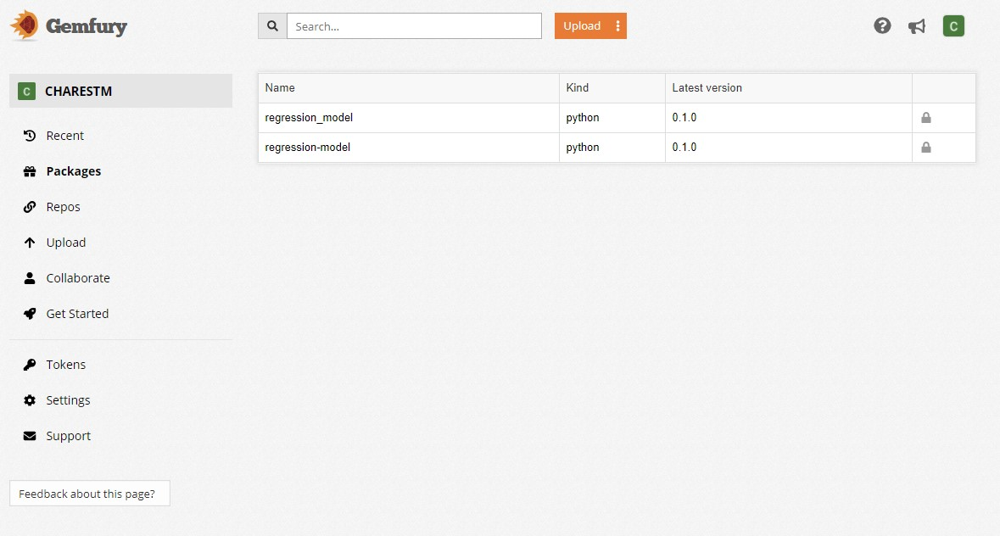

# cours-A61 - TP1 - Préparation de la solution d'IA pour la mise en production
Par : Mathieu Charest-Durand, 2021-02-14

**Ce répertoire GIT a été ouvert dans le cadre du TP1 du cours de préparation de solution d'IA pour la mise en production.**

Il consistait à suivre une série d'étape déterminé dans le travail pratique 1 afin de valider la compréhension des fonctionnalités de Git, des tests untaire, de l'utilisation d'un utilitaire de CI (CircleCI) et d'un utilitaire de publication pour la mise en production (Gemfury)

## Ajustement par rapport aux instructions du TP1
Afin de faire fonctionner le TP, il a fallu adapter un peu le code de base en ajoutant certaines instructions, voici les suivantes : 
- Ajout du fichier __init__.py dans le dossier tests de ml_api
- Modification du config.yml afin d'ajouter l'installation de Kaggle et de l'intégration des libraries de regression_modele
- Ajout de pytest-pythonpath dans le conteneur de développement DEV (prévient les problèmes de pythonpath avec Pytest)

## Exécution en local (avec VSCode)
Afin d'exécuter le code avec VSCode, il s'agit que d'importer le repository Git. Automatiquement, VSCode va suivre les instructions dans devcontainer, faire un conteneur docker et installer tous les requis. 

Le code est après prêt pour utilisation (pas besoin de faire l'installation nous-même)

## Démonstration des exécutions (via CircleCI et Gemfury)
Tout est automatisé en terme d'exécution, compilation automatisé et distribution avec CircleCI et Gemfury.

Voici les preuves de l'exécution de ce repository : 
- Voici un exemple dans Git des différentes versions
    - https://github.com/charestm/cours-A61/commits/main
- Voici un exemple avec CircleCI de l'exécution

- Voici un exemple avec Gemfury de la publication
